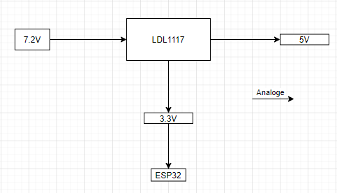

# 

# Project Analyse

# Robot Wagen

# Onderdeel van Smart Systems

Nithujan Selvaratnam

Traject IT&IOT AP Hogeschool

Begeleider: Marc Smets

Academiejaar 2021-2022 2de semester

# Probleemstelling

# Analyse

## Probleemstelling

De studenten van het eerste jaar hebben een robotwagen nodig om hun opdrachten
te maken. Er zijn niet genoeg wagen voor elke studenten. Daarom heeft meneer
Marc Smets opdracht gegeven om een robot wagen te maken Die voldoet aan bepaalde
eisen.

Minimale moet deze eisen voldaan zijn:

-   2 UART connectoren

-   3 I2C connectoren

-   De regelaar 7805 in de oude sturing vervangen door een LDL1117 (5V) en een
    LDL1117(3,3V)

-   Polariteitsbeveiliging voorzien

-   Motordriver in de oude sturing vervangen door een SMD-type

-   OLED-scherm met I2C-sturing voorzien op het bordje

Voor sensoren:

-   Linetracker (dringend)

-   IR-afstandssensoren

-   Ultrasoon afstandssensoren

Er moeten ook verkeersregeling systemen zijn zoals verkeerlichten, slagbomen en
helling en zo. Om de auto te testen.

De auto moet ook manueel met een app of een website rijden en moet ook
automatische rijden.

## Mindemap

## Abstract

## Planning

## Smart Object

Bij de hardware analyse vindt u eerst elke deel van Robotwagen apart en op het
einde worden alle delen samengevoegd.

## Blockdiagram

**Communicatie connector**

| **Naam**                | **specificaties** | **argumentatie**                                                            | **alternatieven** |
|-------------------------|-------------------|-----------------------------------------------------------------------------|-------------------|
| **UART-communicatie**   | Snelheid          | 9600, 19200, 38400, 57600, 115200, 230400, 460800, 921600, 1000000, 1500000 |                   |
| Methoden van verzending | Asynchronous      |                                                                             |                   |
| Maximaal aantal masters | 1                 |                                                                             |                   |
| Maximaal aantal slaven  | 1                 |                                                                             |                   |

**Heeft 2 draden nodig,**

**Heeft geen clock nodig,**

**Verschileden snelheden om te kiezen.**

**Grotte van de gegevens zijn beperkt.**

**Jij moet juiste baud rate bij zetten**

niet van toepassing

**I2C- communicatie**

| Snelheid                | 100Kbps,400Kbps,3.4Mbps |
|-------------------------|-------------------------|
| Methoden van verzending | synchronous             |
| Maximaal aantal masters | 1                       |
| Maximaal aantal slaven  | 128(minder in praktijk) |

**Kan veel data sturen,**

**Kan meerdere slaven hebben om te werken**

**Heef een pull up weerstand nodig.**

niet van toepassing

**ESP32**

ROM: 448 KB SRAM : 520 KB 802.11 b/g/n Wi-Fi connectiviteit Bluetooth 4.2 18 ADC
channels 16 PWM channels Serial connectivieit: 4 x SPI 2 x I²C 2 x I²S 3 x UART

ESP32 is een zeer krachtig microcontroller. Het is ook geschikt om te
communiceren met andere modules. De opdrachtgever gaf immers aan dat deze
component gebruikt moet worden.

niet van toepassing

**Regelaar**

****

| **Naam**   | **specificaties**                                                                                                                                                                                                             | **argumentatie**                                                                                                               | **alternatieven**       |
|------------|-------------------------------------------------------------------------------------------------------------------------------------------------------------------------------------------------------------------------------|--------------------------------------------------------------------------------------------------------------------------------|-------------------------|
| **LD1117** | Ingangsspanning van 2,5 V tot 18 V Beschikbaar op vaste uitgangsspanningen: 1,2 V (1,185 V), 1,5 V, 1,8 V, 2,5 V, 3 V, 3,3 V, 5,0 V Uitgangsstroom 1,2 A Typische uitval 350 mV Bedrijfstemperatuurbereik: -40 °C tot 125 °C  | **Het heeft de nodige spanning en de stroom die we nodig hebben. Het heeft ook goede temperatuur bereik waar die goed werkt.** | **Niet van toepassing** |

**Polariteitbeveiliging**

****

| **Naam**        | **specificaties**                                    | **argumentatie**                                      | **alternatieven**                                  |
|-----------------|------------------------------------------------------|-------------------------------------------------------|----------------------------------------------------|
| **V.b FQP4706** | **RDS = 0.026Ohm** **VGSS = +- 25V**  **MaxP = 62W** | **Heeft lage RDS dus gaat minder vermogen gebruiken** | **Andere Pmost fet die voldoet aan specificaties** |
| **1N5240BF**    | **De U we willen**                                   |                                                       |                                                    |

**Motor driver**

****

| **Naam**       | **specificaties**                                                                                                                                                                                                                          | **argumentatie**                                                                          | **alternatieven** |
|----------------|--------------------------------------------------------------------------------------------------------------------------------------------------------------------------------------------------------------------------------------------|-------------------------------------------------------------------------------------------|-------------------|
| **TB6612FNG**  | Voedingsspanning: VM = 15V max, VCC = 2,7--5,5V Uitgangsstroom: Iout = 1.2A (gemiddeld) / 3.2A (piek) Standby-bediening om stroom te besparen Ingebouwd thermisch uitschakelcircuit en laagspanningsdetectiecircuit Kan 2 motoren sturen.  | **Kan 2 DC motor besturen.** **Heeft ongeboude beveiliging.** **Werkt op genoeg stroom.** | **MC33887**       |
| **Motor**      | DC = 7.2V Amx = 700mA                                                                                                                                                                                                                      | **Die hebben we gekregen.**                                                               | **/**             |

**OLED-Scherm**

| **Naam** | **specificaties**                           | **argumentatie**                                                                                                             | **alternatieven**       |
|----------|---------------------------------------------|------------------------------------------------------------------------------------------------------------------------------|-------------------------|
| SSD1306  | **Vin = 3.3V** **I2C of SPI- Communicatie** | **Heeft niet zoveel kabelsnodig(4)** **Werkt op 3.3V** **Het heeft ook libirary die we kunnen gebruiken om te programeren.** | **Niet van toepassing** |

**Linetracker/IR-sensor/Ultrasoon**

****

| **Naam**                                                                                                                                                                                                                                                                                                                                                                         | **specificaties**                                                                                                                                                                               | **argumentatie**                                                                            | **alternatieven**       |
|----------------------------------------------------------------------------------------------------------------------------------------------------------------------------------------------------------------------------------------------------------------------------------------------------------------------------------------------------------------------------------|-------------------------------------------------------------------------------------------------------------------------------------------------------------------------------------------------|---------------------------------------------------------------------------------------------|-------------------------|
| [Infrarood Detectie Tracking Sensor Module 8 Kanaal Infrarood Detector Board Voor Uitverkoop - Banggood Nederlands sold out-arrival notice-arrival notice](https://nl.banggood.com/Infrared-Detection-Tracking-Sensor-Module-8-Channel-Infrared-Detector-Board-p-1194010.html?imageAb=1&rmmds=search&cur_warehouse=CN&akmClientCountry=BE&a=1647003275.9856&akmClientCountry=BE) | Werkspanning: 5V 8-kanaals infrarood detector                                                                                                                                                   | **Heeft 8 kannen dus het kan de lijn goed zien. Werkt ook op 5V.**                          | **Niet van toepassing** |
| IR-Sensor HiLetgo 10pcs IR Infrared Obstacle Avoidance Sensor                                                                                                                                                                                                                                                                                                                    | 1 VCC 3.3V-5V externe spanning (kan direct worden aangesloten op 5v en 3.3v MCU MCU) 2 GND GND Extern 3 OUT klein bord digitale uitgang interface (0 en 1) Uin = 3.3V of 5V Afstand = 2 ot 30Cm | **Het is klein en compact.** **Heeft ook genoeg werkende afstand.** **Werkt op 3.3 en 5v.** | **/**                   |
| Ultrasoon  HC-SR04 Ultrasonic Sensor                                                                                                                                                                                                                                                                                                                                             | **Power Supply**                                                                                                                                                                                | 5V DC                                                                                       |                         |
| **Working Current**                                                                                                                                                                                                                                                                                                                                                              | 15 mA                                                                                                                                                                                           |                                                                                             |                         |
| **Working Frequency**                                                                                                                                                                                                                                                                                                                                                            | 40 kHz                                                                                                                                                                                          |                                                                                             |                         |
| **Maximum Range**                                                                                                                                                                                                                                                                                                                                                                | 4 meters                                                                                                                                                                                        |                                                                                             |                         |
| **Minimum Range**                                                                                                                                                                                                                                                                                                                                                                | 2 cm                                                                                                                                                                                            |                                                                                             |                         |
| **Measuring Angle**                                                                                                                                                                                                                                                                                                                                                              | 15º                                                                                                                                                                                             |                                                                                             |                         |
| **Resolution**                                                                                                                                                                                                                                                                                                                                                                   | 0.3 cm                                                                                                                                                                                          |                                                                                             |                         |
| **Trigger Input Signal**                                                                                                                                                                                                                                                                                                                                                         | 10uS TTL pulse                                                                                                                                                                                  |                                                                                             |                         |
| **Echo Output Signal**                                                                                                                                                                                                                                                                                                                                                           | TTL pulse proportional to the distance range                                                                                                                                                    |                                                                                             |                         |

**Heeft maar 4 pinnen nodig.**

**Heeft lange beriek om afstand te meten**

**/**

**Volledig Schema**

****

## Elektrische schema

## Software analyse

## Data in/Out

## State diagram

## Flowchart

## Mockup
